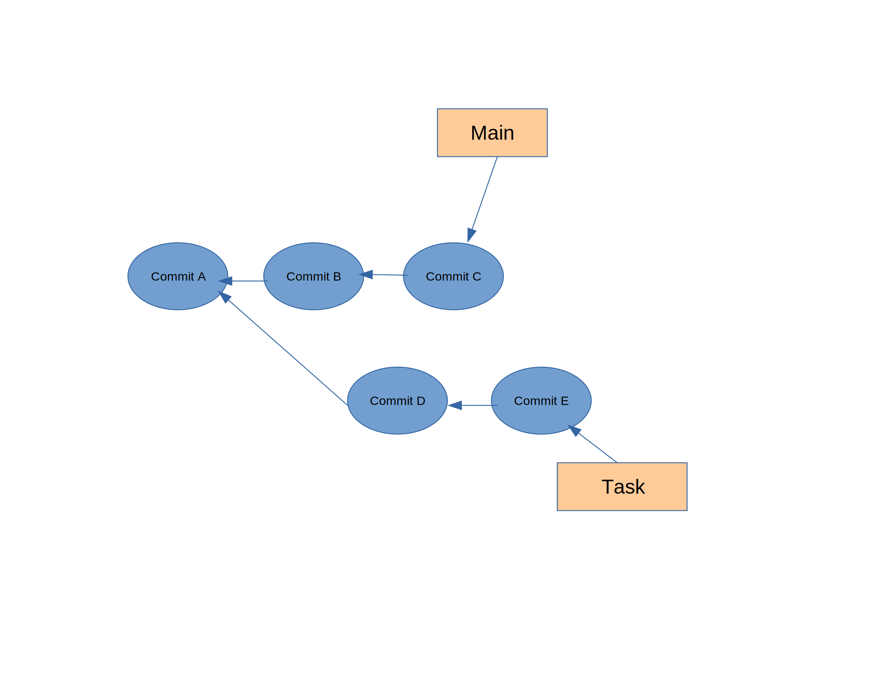

# Legion Source Control

June 2021

---
# Legion Source Control
- Requirements and implications
- Data structures and architecture
- Roadmap

---

# Requirements

- Unified code & data solution
- Large binary files: Central database
- Support for live workflows: Branches
- Predictable merges: Central locking across branches
- Support for distributed build tools: Shared virtual workspaces

---

# Requirement: Unified code & data solution

- Code and data have interdependencies
- Atomic changes across code & data in a single commit
- Unified tools and processes for all crafts

---

# Requirement: Large binary files

- Fully distributed history is impractical when dealing with large binary files
- Central database and shallow (or even virtual) workspaces are the way to go here

---

# Requirement: Support for live workflows

- Branches!
- Git branches are very efficient in size and speed

---

# Requirement: Predictable merges

- Conflicts are the dark side of branches
- Central locking à la perforce is not good enough with binary files
  * Only pushes back the conflict to the branch merge
- Solution: locking across branch families
  * Implicit lock domains based on explicit branch parenting
  * Attached branches share a lock domain
  * Detaching a branch creates a new lock domain
- Even better: app metadata `inside` the lock
  * Allows to override/augment lock when conflict-free merge is guaranteed

---

# Requirement: Support for distributed build tools
## Problem statement
> Hundreds of instances of a microservice are spawned to work on a small part of the data kept under source control. How can we give them efficient access in read and write?


---

## Shared, virtual workspaces

Like a local workspace, it's a set of modifications based on a branch.

- Unmodified files are fetched on demand.
- No concurrency guarantees.
- Makes possible tight collaboration workflows
  * one workspace shared by many people
  * auto-sync workspace that's always on latest (except for modified files)

---

# Non-requirements (for now)
 - Access control
 - On-site cache or commit servers
 - CI/CD specific features
 - Task tracking integration

 ---
# Legion Source Control
- Requirements and implications
- **Data structures and architecture**
- Roadmap

---
# Data: commit
> like git, but centralized



- branch has a commit pointer
- commits are back-linked
- blobs and trees are stored in content adressable storage

---
# Data: commit

```
pub struct Commit {
    pub id: String,
    pub owner: String,
    pub message: String,
    pub changes: Vec<HashedChange>,
    pub root_hash: String,
    pub parents: Vec<String>,
    pub date_time_utc: String,
}
```

---
# Data: branch
```
pub struct Branch {
    pub name: String,
    pub head: String, //commit id
    pub parent: String,
    pub lock_domain_id: String,
}
```

---
# Data: tree

```
pub struct TreeNode {
    pub name: String,
    pub hash: String,
}

pub struct Tree {
    pub directory_nodes: Vec<TreeNode>,
    pub file_nodes: Vec<TreeNode>,
}
```

Hash of a file node points to a blob.
Hash of a directory node points to a tree.

Every commit has a different root.
Unchanged directories refer to the same tree nodes.

---
# Data: local workspace

- Branch name and commit
- Local changes
- Pending file resolves
- Pending branch merge
- **physical copy of all the files in the commit's tree**

---
# Data: repository

- Trees
- Commits
- Blobs
- Branches
- Workspaces
- Lock domains