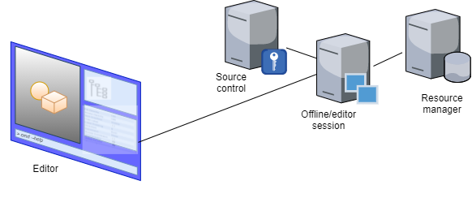

# High level flows

The following use cases will help contextualize and understand the overall flow between the different applications making up the Legion engine and its client applications.

Some paragraphs are prefixed with the :large_orange_diamond: symbol to indicate that they are still are undecided and need to be confirmed.

## Game production / development

The Legion engine provides a full production pipeline for the creation of games and interactive environments.

In these game production scenarios, the user is part of the game development team in a company that is a client of Legion Labs.

### Startup sequence

The user starts up the Legion Labs editor.

> The editor could be a stand-alone application (that was previously installed), or accessible through a web browser. To be determined...

If accessing for the first time, the user must first select which project to work on (the company could be working on several titles), and then which specific world within the project to open. If returning, the settings will default to the values from the previous session.

> If a project contains a single world, or has a base root world, it will be selected by default.

The editor will then open up and be ready for the user to browse and edit the world's contents.

### Collaboration

By choosing to use shared virtual workspaces, users have the advantage of always seeing the latest changes from their team.

### Importing source data

Many types of resources will be edited outside of the Legion Labs editor.

This includes (but is not limited to):
* Textures
* Visual meshes
* Animations
* Sound

These will be created and edited in dedicated applications, such as Autodesk Maya or 3D Studio Max for visual meshes, and then imported into the source-control system.

A DCC (Digital Content Creator) importer, one per resource type, will convert the data to an offline format that is usable in the editor.

Users can also import data from external content management systems such as [Quixel Bridge](https://help.quixel.com/hc/en-us/articles/115000613105-What-is-Quixel-Bridge-).

Changes in source data (external formats) will trigger an update of the offline data.

### Testing changes

At any time, users can launch a play session from the editor. This will open up a new viewport in which allows interactions with a running game engine.

The engine will used compiled runtime data, that contains all the changes local to the shared virtual workspace.

:large_orange_diamond: The game session can also be joined by other users, allowing multiplayer interactions.

Other than savegames, these game sessions do not persist data. Any changes to the game environment, such as destruction effects for example, will not affect the offline data and remain circumscribed to the lifetime of the game session.

:large_orange_diamond: When offline data is modified, either directly in the editor or when associated source data gets updated, this in turn will incrementally recompile the runtime data. Updated runtime data will be hot-reloaded in active game sessions.

### Scripting game logic

!todo

### Production analytics

!todo

### Outsourcing

How to work with an external localization contractor?

## Game live operations

!todo

### Packaging a release

!todo

### First party submissions

!todo
