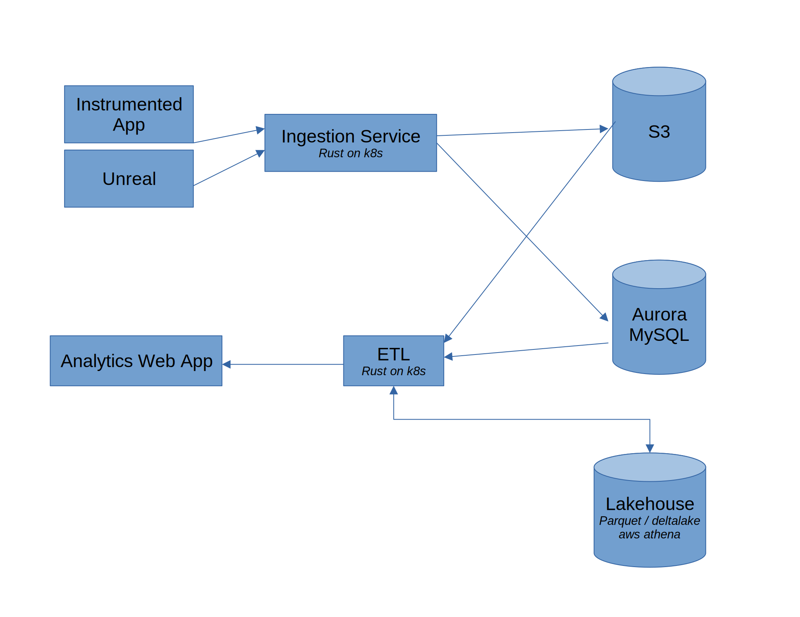
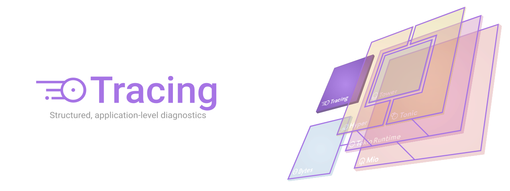

# Legion Performance Analytics

Septembre 2021

---
# Legion Performance Analytics
- **Introduction**
- Requirements
- Architecture
- Roadmap

---

# Introduction
## Definition
- `Performance`: quantified non-functional requirement
- **The test of the machine is the satisfaction it gives you.**― Robert M. Pirsig, _Zen and the Art of Motorcycle Maintenance: An Inquiry Into Values_
- Performance for software
  - Latency
    * ex.: frame time, reaction time, replication time, load time
  - Stability
    * ex.: MTBF, crashes, error logs, memory use
  - Satisfaction
    * ex.: retention, engagement, biometrics, surveys

---

# Introduction
## Stages of data storage

- **in-app**: buffered streams of structured events
- **Data Lake**
  * write-friendly format
  * shallow index
- **Data Warehouse**
  - ephemeral subset
  - deeply indexed
  - SQL

---

# Introduction
## Levels of analytics

- in-app: basic stats, adjust level of details of telemetry
- Basic stats over multiple sessions: MTBF, max memory use
- Deep inspection of a single session: Mem use of every asset, flame graphs
- Aggregates of high-frequency events over many sessions: Heat maps
---

# Legion Performance Analytics
- Introduction
- **Requirements and implications**
- Architecture
- Roadmap

---
# Requirements
## Frequency of events

- High Frequency: thousands of events per frame
  * begin/end function call
  * begin/end asset-specific scope
  * memory alloc/free

---
# Requirements
## Frequency of events

- Frame metrics
  * frame time, engine time, render sync
  * player health, #npcs
  * process memory allocated/available
  * i.e. mostly time series
  
---
# Requirements
## Frequency of events

- Behaviour events
  * begin/end system state
  * gameplay events
  * user input
  
---
# Requirements
## Frequency of events

- Logs
  * begin/end app state (world loaded, in-play, matchmaking)
  * warnings
  * crashes with callstack

---
# Requirements
## Generic and Extensible event stream format

- Open/Closed principle: open for extension, but closed for modification
- Adding a feature-specific event should have no impact on ingestion pipeline
- No magic: specific reports/views depend on the presence of specific events
  * tagging of streams to advertise the purpose/suitability
  * i.e. dynamic duck typing
- not limited to time series

---
# Requirements
## Generic and Extensible event stream format
### Performance characteristics
- write-friendly
  * most work is done with memcpy
  * important size optim: object references
- ingest-friendly
  * store without parsing whole block
  * compressed payload is not decompressed
- generic reader
  * as generic as JSON
  * metadata to decode the writer's memory model
---
# Requirements
## Understanding distributed applications

- one application session can extend to multiple processes
- sync clock easier for RPC model of distributed computation

---
# Requirements
## 5 views to rule over all data
### List / Table / Search

* recent sessions
* top crashes
* cpu budget report
  
---

# Requirements
## 5 views to rule over all data
### Time series

* Individual frame times over time
* Player health over time
* Cohort engagement over 30 days

---
# Requirements
## 5 views to rule over all data
### Graphs & Trees

* Cumulative function call statistics
* Loaded object graph

---
# Requirements
## 5 views to rule over all data
### Timeline

* Call tree instances per thread

---
# Requirements
## 5 views to rule over all data
### Heatmap

* death map
* geographic slow frames distribution

---
# Requirements
## non-requirements

- interactive debugging
- per-pixel profiling
- low-level cpu events (L1 cache miss, branch mispredictions, ...)

## not yet
- Video streaming & overlay
- cpu sampling
- context switches

---
# Legion Performance Analytics
- Introduction
- Requirements
- **Architecture**
- Roadmap

---
# Architecture
## Object hierarchy

- Process instance 
  - Stream
    - Stream block
      - Event

---
# Architecture
## Online architecture

---
# Architecture
## Integration/reuse of existing solutions

Many ideas in common with `tracing` crate from the `tokio` project.
https://docs.rs/tracing/0.1.26/tracing/
But `Collect` trait at the center of the system is a poor fit.

Could support the interface to get visibility into crates that are already instrumented.

---
# Legion Performance Analytics
- Introduction
- Requirements
- Architecture
- **Roadmap**

---
# Progress 2021

<!--- (https://www.pngegg.com/en/png-zocmk)-->

## Halloween 2021

- Initial version of client telemetry library
- Local ingestion server (sqlite & files)
- CLI analytics (csv output)

## Christmas 2021
- Web Analytics client (svelte & Canvas)
- Visualization of call tree timeline

---
# Progress 2022

## January 2022
- Logging improvements, Timeline levels of details

## February 2022
- Cloud infra, Time series, UI redesign

## March 2022
- Time series & Timeline improvements, Async function tracing

---
# Roadmap

## April 2022
- Unreal telemetry module (MAD)
- Cumulative call graph improvements (Tim)

## May 2022
- Unreal telemetry module (MAD)
- GCP
- Log screen

---
## Backlog
- Support for Google Cloud Storage
- i18n
- Review regulatory requirements
- Landing page
- Logs (dual mode)
  * Paging when not filtering
  * n-first results when there is a filter
  
---
## More Backlog
 
- Async spans stitching/LOD
- GPU profiling
- Memory profiling
- Object Graphs
  * Why is this texture loaded?
- Process dashboards
  * monitoring thousands of processes
- Fluentd output command
- Task-based timeline & async span parenting
  * unifying thread-bound and async tasks
- Heat maps
- Real-time logs, metrics and timeline

---

